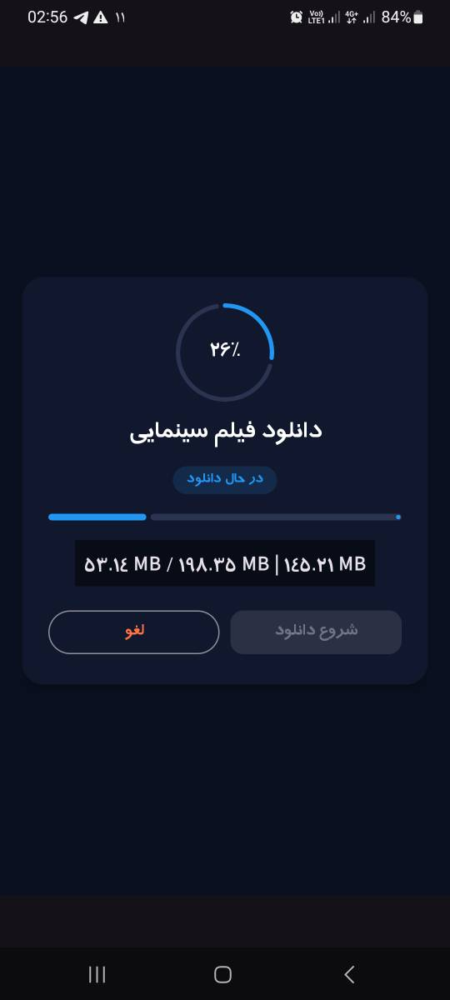

# 📥 Downloader (Kotlin + Compose + OkHttp)

A modern Android file downloader built with **Kotlin**, **Jetpack Compose**, and **OkHttp**, featuring real-time progress tracking, clean architecture, and robust error handling.

---

screenshot:


## 🚀 Features

- 📡 Download files from direct URLs (supports large files)
- 📊 Real-time progress tracking (0% → 100%)
- 🧠 Clean architecture (ViewModel + Repository pattern)
- ⚡ Coroutine + Flow-based streaming download
- ❌ Cancel download anytime
- ⚠️ Error handling with sealed classes
- 🎯 Modern UI built with Jetpack Compose (Material 3)
- 💾 Saves files to app-specific storage

---

## 🧱 Tech Stack

- Kotlin
- Jetpack Compose
- AndroidX ViewModel
- Kotlin Coroutines + Flow
- OkHttp
- Material 3

---

## 🏗 Architecture


UI (Jetpack Compose)
↓
ViewModel
↓
Repository
↓
OkHttp Client


### Responsibilities:

- **ViewModel**
  - Manages UI state (progress, status, errors)
  - Handles user actions (start / cancel download)

- **Repository**
  - Handles network request (OkHttp)
  - Streams file bytes
  - Emits progress via Flow

- **Flow**
  - Provides real-time updates to UI

---

## 📦 Download Flow

1. User clicks **Start Download**
2. ViewModel triggers Repository
3. OkHttp starts streaming file
4. File is written to disk chunk by chunk
5. Progress updates are emitted via Flow
6. UI updates instantly

---

## 📊 Download States

```kotlin
sealed class DownloadResult {
    data class Progress(val percent: Float, val code: Int) : DownloadResult()
    object Success : DownloadResult()
    data class Error(val message: String) : DownloadResult()
}
States handled in app:
Downloading 📥
Completed ✅
Cancelled ❌
Failed ⚠️
📸 UI Preview

Add screenshots or GIFs here

Example UI elements:

Progress indicator
Download percentage
File size (MB)
Cancel button
Status badge
📂 Output Location

Downloaded file is saved in:

/Android/data/<package_name>/files/Download/calendar.apk
🧠 Key Concepts Used
Coroutine cancellation with Job
Cold Flow for streaming downloads
File I/O with buffering (ByteArray)
State management with StateFlow
Reactive UI with Jetpack Compose
⚙️ How to Run
1. Clone repository
git clone https://github.com/your-username/repository-name.git
2. Open in Android Studio
Latest stable version recommended
3. Run on emulator or physical device
Minimum SDK: (add your value here)
📌 TODO (Future Improvements)
 Pause / Resume download
 Multi-file downloader
 Background download service
 Notification progress bar
 Retry mechanism with exponential backoff
 Download speed indicator (KB/s, MB/s)
👨‍💻 Author

Ali Mahjoob

Android Developer
Kotlin • Jetpack Compose • Clean Architecture

⭐ Support

If you like this project:

⭐ Give it a star on GitHub
🍴 Fork it and improve it
💬 Share feedback
